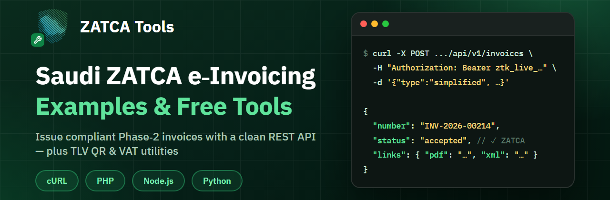

<p align="center">
  <a href="https://zatcatools.up.railway.app"></a>
</p>

# Saudi ZATCA e-Invoicing — Examples & Free Tools

Ready-to-run integration examples and free developer tools for **Saudi Arabia's e-invoicing (ZATCA Phase 2 — Fatoora)**.

Brought to you by [**ZATCA Tools**](https://zatcatools.up.railway.app) — the fastest way for Saudi businesses to connect to ZATCA and issue compliant, cryptographically-signed e-invoices in minutes. No accounting system required. **First 50 invoices free.**

| | |
|---|---|
| 🌐 App | [zatcatools.up.railway.app](https://zatcatools.up.railway.app) |
| 📚 API docs | [zatcatools.up.railway.app/docs/api](https://zatcatools.up.railway.app/docs/api) |
| ✍️ Blog (Arabic guides) | [zatcatools.up.railway.app/blog](https://zatcatools.up.railway.app/blog) |

---

## Quick start

Issue a ZATCA-compliant invoice in one API call — the platform handles the hard parts (UBL XML, XAdES digital signature, TLV QR code, ICV/PIH chain, clearance/reporting with ZATCA) and returns the accepted invoice with ready PDF/XML links:

```bash
curl -X POST https://zatcatools.up.railway.app/api/v1/invoices \
  -H "Authorization: Bearer ztk_live_YOUR_KEY" \
  -H "Content-Type: application/json" \
  -d '{"type":"simplified","lines":[{"name":"Consulting service","quantity":1,"unit_price":500}]}'
```

> 🔑 **Getting an API key**: [sign up free](https://zatcatools.up.railway.app/start) → complete Fatoora onboarding → Settings → API tab → *Generate key*.

## 📦 What's inside

### 1) API integration examples — [`examples/`](examples/)

Issue an accepted tax invoice in under 30 lines, with zero external dependencies:

| Language | File |
|---|---|
| cURL (all endpoints) | [`examples/curl/README.md`](examples/curl/README.md) |
| PHP | [`examples/php/issue-invoice.php`](examples/php/issue-invoice.php) |
| Node.js 18+ | [`examples/node/issue-invoice.mjs`](examples/node/issue-invoice.mjs) |
| Python 3 | [`examples/python/issue_invoice.py`](examples/python/issue_invoice.py) |

Covered: simplified (B2C) & standard (B2B) invoices, credit/debit notes, listing with filters, and downloading the signed **PDF / UBL XML / QR**.

### 2) Free developer tools — [`tools/`](tools/)

Standalone utilities, useful even if you don't use our platform:

| Tool | What it does |
|---|---|
| [`qr-tlv-decoder`](tools/qr-tlv-decoder/) | Decode any Saudi invoice QR code (base64 TLV → readable fields, Phase 1 & 2 tags) |
| [`qr-tlv-generator`](tools/qr-tlv-generator/) | Generate a Phase-1-compliant TLV QR payload |
| [`vat-validator`](tools/vat-validator/) | Validate a Saudi VAT registration number (15 digits, format rules) |

## Why ZATCA Tools?

- ⚡ **Onboarding in minutes** — CSR, compliance CSID, the 6 compliance checks, and production CSID are fully automated
- 🧾 **Standard (B2B) & simplified (B2C) invoices** — signed, cleared/reported, with credit & debit notes
- 🔗 **Clean REST API** — JSON in, accepted invoice + PDF out; uniform `{error:{code,message}}` errors
- 🗄️ **XML/PDF archive** of every invoice in its official format
- 🆓 **Free** — first 50 invoices, no card required

## Contributing

Found a bug, or want to add an example in another language (C#, Go, Java…)? Issues and PRs are welcome 🤝

## License

[MIT](LICENSE) — use freely in your own projects.

---

<div dir="rtl">

## ملخص بالعربي

هذا المستودع يقدّم أمثلة تكامل جاهزة (cURL / PHP / Node.js / Python) وأدوات مجانية (فك وتوليد رمز QR بصيغة TLV، والتحقق من الرقم الضريبي) للفوترة الإلكترونية السعودية — المرحلة الثانية (فاتورة). مقدّم من [ZATCA Tools](https://zatcatools.up.railway.app): اربط منشأتك مع هيئة الزكاة وأصدر فواتير معتمدة خلال دقائق، مجانًا بأول 50 فاتورة. التوثيق الكامل بالعربي: [docs/api](https://zatcatools.up.railway.app/docs/api).

</div>
